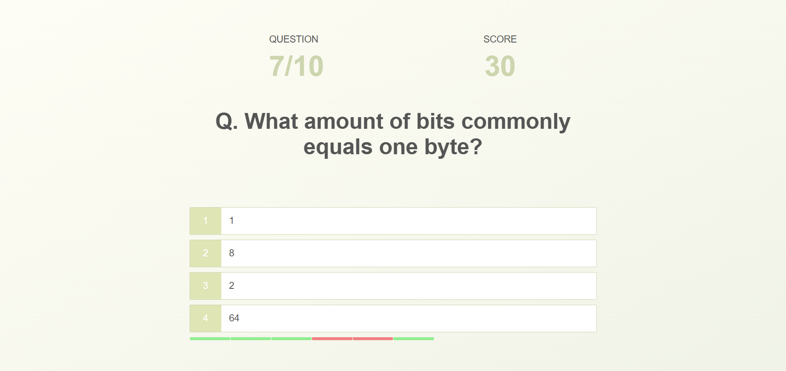

# Quiz Application

The Quiz Application is an interactive platform where users can take quizzes consisting of 10 multiple-choice questions. Each question offers four possible answers, and users earn points based on their performance. This project aims to enhance learning through gamification and provide a fun way to test knowledge.

## Demo

## Features

- **Quiz Format:** 10 multiple-choice questions per quiz with 4 answer options each.
- **Scoring System:**
  - +10 points for each correct answer.
  - -5 points for each incorrect answer.
- **User Profiles:** Users can save their scores along with their names.
- **High Scores Page:** View rankings and compare scores with other users.

## Technologies Used

- **Frontend:** HTML 5, CSS, JavaScript (ES6)
- **Other:** Open Trivia DB API

## Key Learnings

- Save high scores in Local Storage.
- Create a progress bar to visualize correct or incorrect answers.
- Design a spinning loader icon for loading states.
- Dynamically generate HTML using JavaScript.
- Fetch trivia questions from the Open Trivia DB API.
- Utilize JavaScript array functions (splice, map, sort), Local Storage, and Fetch API.
- Implement ES6 JavaScript features such as arrow functions, the spread operator, `const` and `let`, and template literals.
- Apply CSS techniques including Flexbox, animations, and REM units for responsive design.

## Usage

- Start the quiz, answer the questions, and see your score!
- Save your score with your name to track your performance.
- Visit the high scores page to see your ranking among other users.

## Limitations

- Certain symbols (like `""`, `{}`, `()`, etc.) may display as their code representation instead of the intended symbols.

## Contributing

Contributions are welcome! If you'd like to contribute, please fork the repository and create a pull request. For major changes, please open an issue first to discuss what you would like to change.

## Acknowledgments

- Inspired by Jonas Quick's project "Quick Quiz App."

`
Feel free to adjust any part of this to better fit your style or add more details as needed. If you have anything else to include or modify, just let me know!
`
